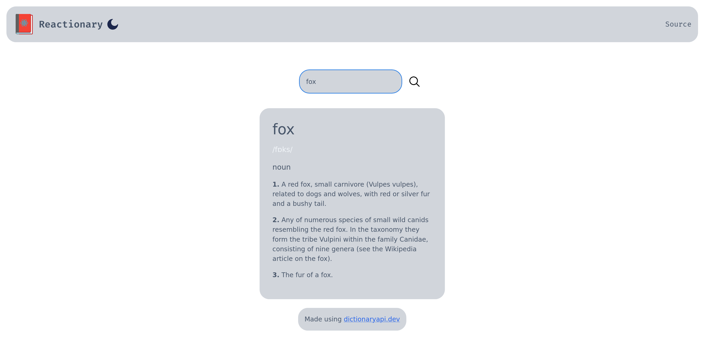

  

# Reactionary

React + Dictionary = Reactionary! Get it..? 

Made with [dictionaryapi.dev](https://dictionaryapi.dev/).  

 

Thanks to [@meetDeveloper](https://github.com/meetDeveloper/googleDictionaryAPI) for maintaing the API.
